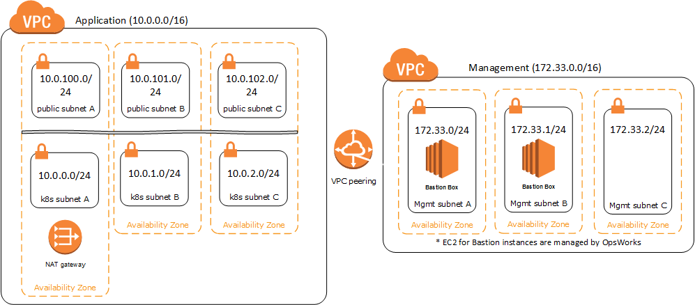

# kubernetes-on-aws
Cloudformation scripts to deploy Kubernetes cluster on AWS, everything is TLS and secured. The only public components are the kubernetes services that get exposed via Elastic Load Balancers via service type `LoadBalancer`.

## Overview

There are two different CloudFormation templates, [network-template](cloudformation/network-template.json), [k8s-template](cloudformation/k8s-template.json).

### Technologies

- CoreOS (Stable) for k8s master and nodes
- OpsWorks to manage bastion instance running Amazon Linux

### cloudformation/network-template.json

The network template is designed to provide a set of VPC's, subnets, and internet gateways to provide a basic "shell" to deploy AWS infrastructure into. This base architecture is modeled after the [NIST Template](https://aws.amazon.com/about-aws/whats-new/2016/01/nist-800-53-standardized-architecture-on-the-aws-cloud-quick-start-reference-deployment/) by only allowing access via a bastion instance. Access to the bastion instance is provided via OpsWorks to manage individual user keys on the box.



### cloudformation/k8s-template.json

The k8s template is used to deploy a kubernetes cluster into the network-template or your own existing infrastructure. This is important as the k8s template was designed to not force users into any base infrastructure. All that is required to deploy the k8s template is a VPC, and a route table. The template creates it's own subnets and permissions, but everything else is left up to the user.

_NOTE: The network template provided is NOT required to use the k8s template._

## Deployment with Base Template

1. Modify SAN for certs by changing DNS entry in [openssl.cnf](scripts/certs/openssl.cnf) to match requirements (If required)

2. Generate RootCA: `./scripts/certs/generate-root-ca-certs.sh`

3. Generate API Server Certs: `./scripts/certs/generate-api-server-certs.sh`

4. Generate Worker Certs: `./scripts/certs/generate-worker-certs.sh`

5. Convert the keys generated in previous steps to base64 by running `./scripts/certs/convertcerts2base64.sh`

6. Create ssh keypair for cluster management (All servers behind bastion will use this key)

7. Login to AWS console and run getting starting wizard for OpsWorks. This creates the needed roles to create the OpsStack for our deployment

8. Create the base stack (`cloudformation/NetworkBaseline.json`) by navigating to AWS CloudFormation screen, and uploading file, then executing

9. Create the Kubernetes stack (`cloudformation/k8s-template.json`) by navigating to the AWS CloudFormation screen, and uploading file, then executing. _NOTE: The table to use can be found named: `Route Table for Private Networks`._

_NOTE: Only generate the RootCA once! If RootCA is regenerated, will need to re-create all certs._

### Configure Kubectl

Use the certs created in the generate certs section to configure local kubectl.

```
$ kubectl config set-cluster aws --server=https://[name matching cert SAN from above]:9443 --certificate-authority=${CA_CERT}
$ kubectl config set-credentials aws-admin --certificate-authority=${CA_CERT} --client-key=${ADMIN_KEY} --client-certificate=${ADMIN_CERT}
$ kubectl config set-context aws-admin --cluster=aws --user=default-admin
$ kubectl config use-context aws-admin
```

_NOTE: Since access to the k8s api will be via the bastion box, can setup a hosts entry in your system hosts file (e.g. /etc/hosts) which points to localhost but matches a SAN created above. This is also why port 9443 is used._

##### Example hosts file:

Here I added `127.0.0.1 kubernetes` to my local hosts file.

```
##
# Host Database
#
# localhost is used to configure the loopback interface
# when the system is booting.  Do not change this entry.
##
127.0.0.1       localhost
255.255.255.255 broadcasthost
::1             localhost
127.0.0.1       kubernetes
```

## SSH Access Tunneling via Bastion Box

To access the k8s api via `kubectl` use the following command to create a persistent tunnel:
```
ssh -L 9443:10.0.70.50:443 ec2-user@[BastionIPAddress] -N
```

### Setup access to bastion via OpsWorks

1. Login to AWS console and choose OpsWorks
2. Select Stack
3. On left menu choose `Permissions`
4. Top right button choose `Edit`
5. Select IAM users who need access and choose `Save`
6. Verify status by refreshing `Deployments`

_NOTE: Users must have uploaded keys to their profile via OpsWorks. The nice part is no shared keys and access can be controlled centrally._
